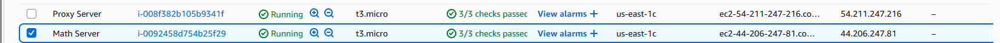
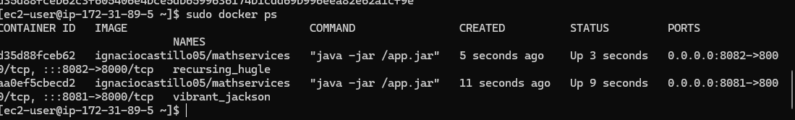
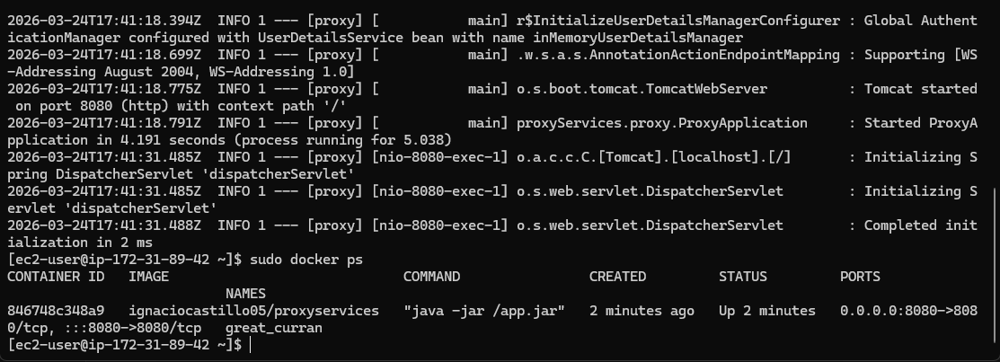
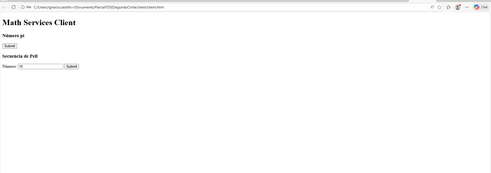
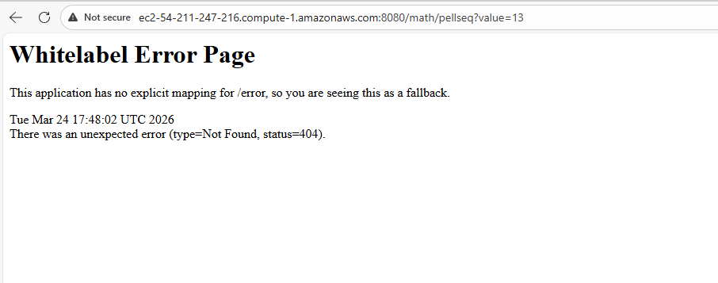
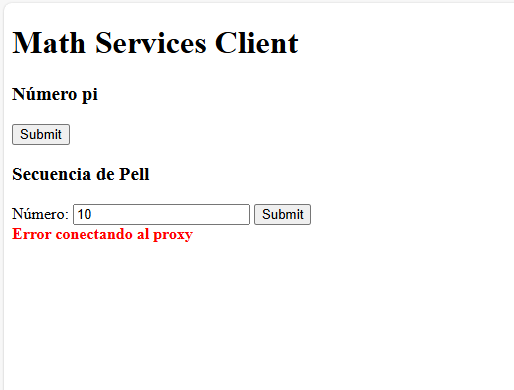
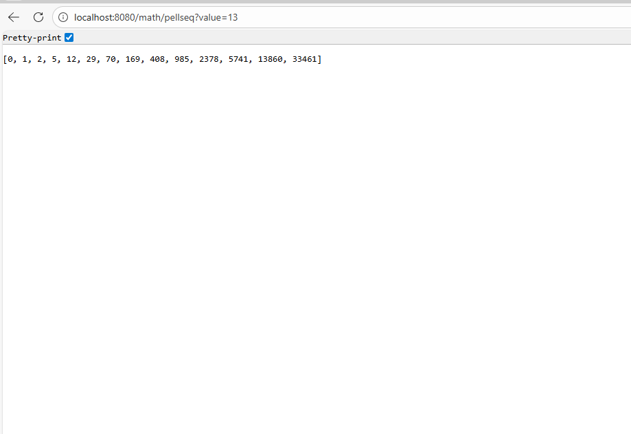

# ParcialTDSESegundoCorte
Parcial de segundo corte de TDSE

Evidencia de funcionamiento:
Instancias desplegadas:

Cliente HTML:

Hubo errores con el tema de las instancias porque es que el client.html no se conectaba al proxy. Porque al entrar me tiraba error 404.

Sin embargo, la implementación fue correcta del ejercicio requerido, solo que las instancias fallaron (tuve que correrlo de manera local con spring-boot para la prueba)

LINK VIDEO: <video controls src="20260324-1751-56.1234574.mp4" title="Title"></video>